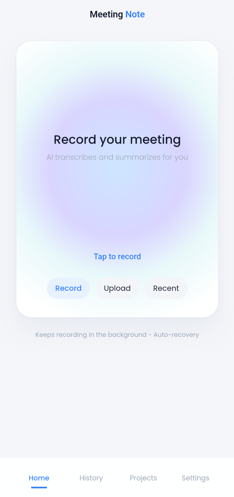

# Meeting Note — Product Landing Page

A single-page marketing site for the **Meeting Note** mobile app (iOS + Android),
built on the **TecAce Design System** (fonts, color, spacing, and type scale
transcribed from the design system into `assets/tokens.css`).

## Run it

It's a static page — no build step. Just open `index.html`, or serve the folder:

```bash
# from the product-page/ folder
python -m http.server 8080
# then visit http://localhost:8080
```

## Files

| File | Purpose |
| --- | --- |
| `index.html` | The page markup and copy |
| `assets/tokens.css` | TecAce design tokens (colors, type, spacing) + light/dark themes |
| `assets/page.css` | Page layout, components, and scroll effects |
| `assets/app.js` | Theme toggle, scroll reveal, sticky stepper, FAQ accordion |
| `assets/media/` | **Drop your screenshots & GIFs here** |

## Add your screenshots / GIFs

Every placeholder on the page is a dashed **media slot** labeled with the exact
filename it expects. To fill one, drop your image into `assets/media/` and replace
the slot's `<div class="media-slot">…</div>` with an ``. Each slot already has
the correct `` line commented out right above it — just uncomment and delete
the placeholder `div`.

Suggested media (phone screens are portrait ~9:19.5; the split-row frames are 4:3):

| Slot | File | What to show |
| --- | --- | --- |
| Hero phone | `hero-record.png` | The Record screen (hero shot) |
| Step 1 | `step-1-record.png` | Tap-to-record |
| Step 2 | `step-2-setup.png` | New meeting note setup |
| Step 3 | `step-3-processing.gif` | Upload → Transcribing → Summarize → Done |
| Step 4 | `step-4-summary.png` | Summary + transcript tabs |
| Step 5 | `step-5-projects.png` | Projects list / detail |
| Capture row | `capture-waveform.gif` | Live recording with waveform |
| Summarize row | `summarize-result.png` | Summary result screen |
| Organize row | `organize-project.png` | Project detail + AI chat |

Example — turning the hero slot into a real image:

```html
<div class="phone-screen">
  
</div>
```

## Notes

- **Light & dark**: the page follows the OS theme and has a manual toggle (top-right).
- **Fonts** load from CDN (Pretendard + Poppins) to match the design system.
- **Accessibility**: honors `prefers-reduced-motion`, semantic landmarks, keyboard-operable FAQ.
- Copy is grounded in the app's real, implemented features (background recording &
  auto-recovery, speaker-diarized transcripts, custom summary prompts, Projects with
  AI chat, attachments, OneDrive export, ChatGPT/Claude MCP). App Store / Google Play
  buttons currently link to `#` — point them at your store listings when live.
